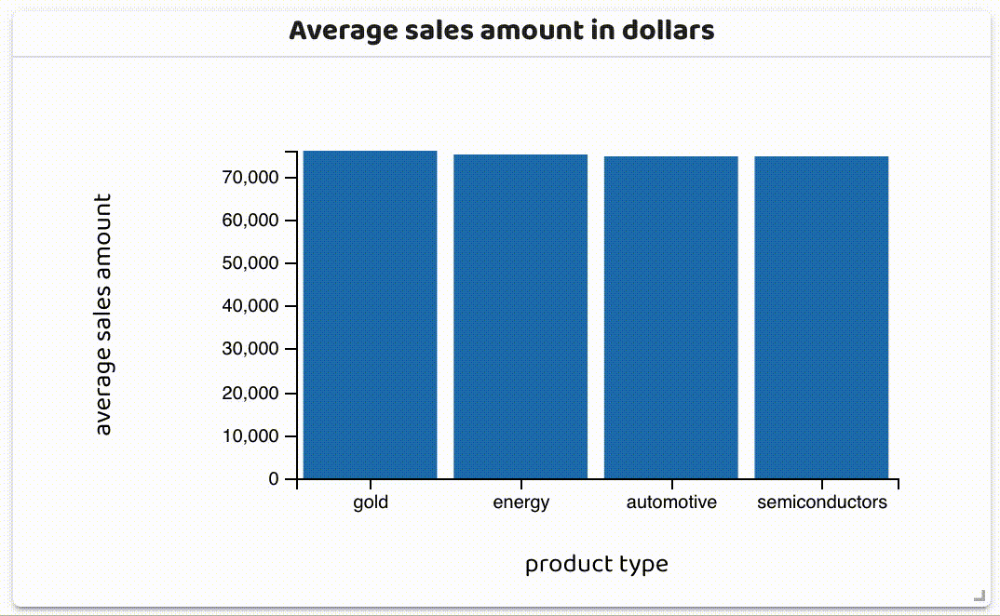
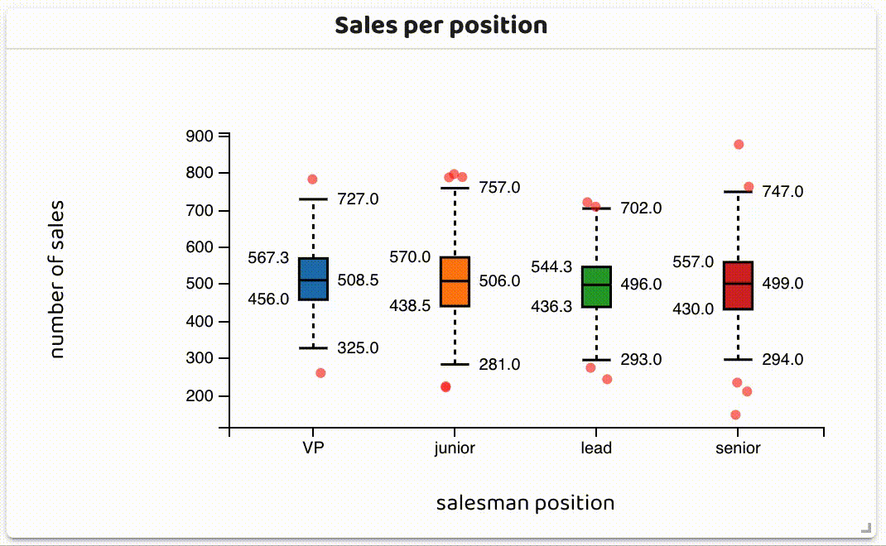
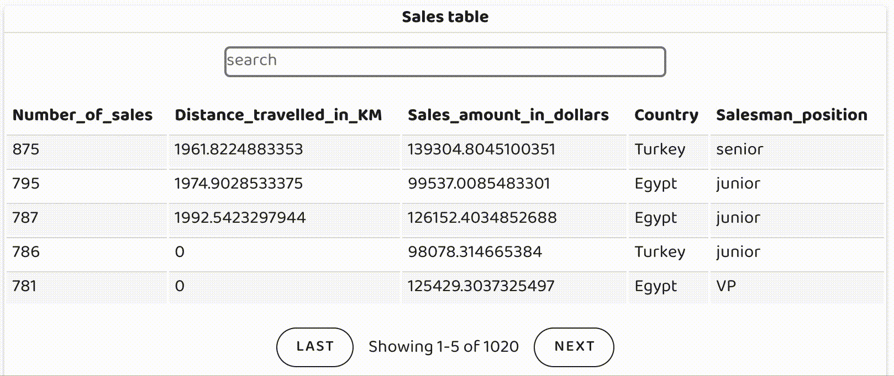
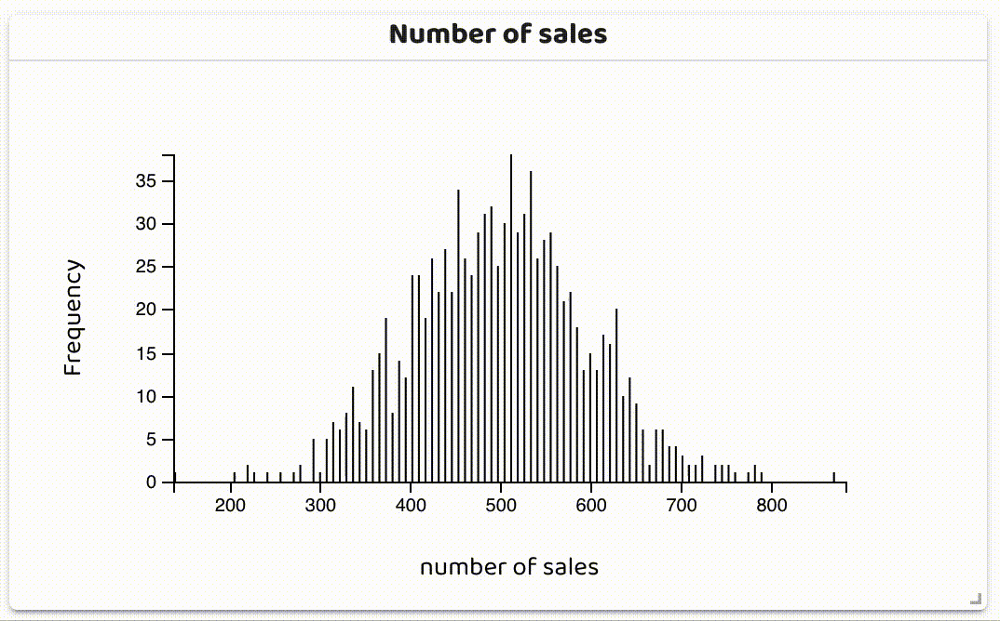
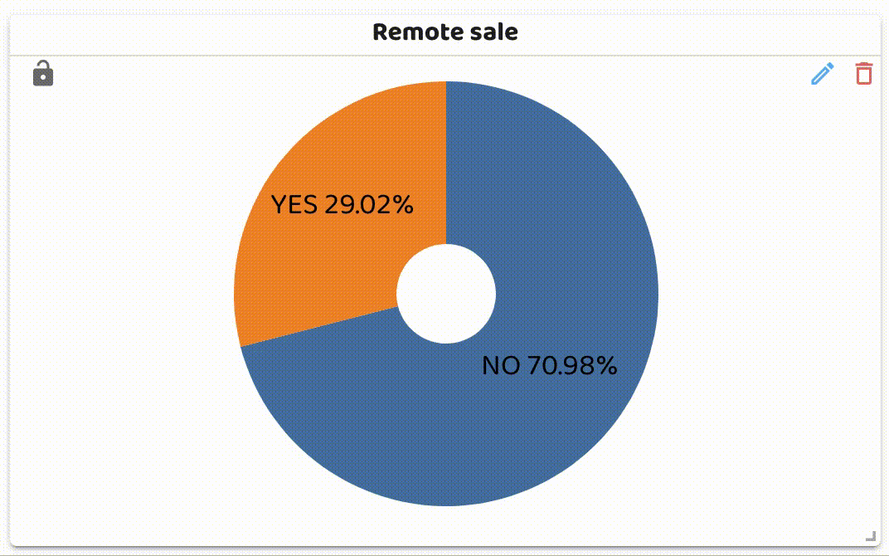
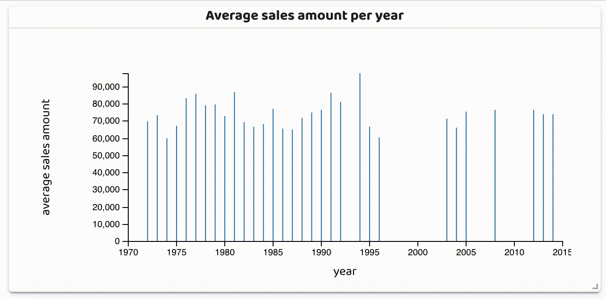
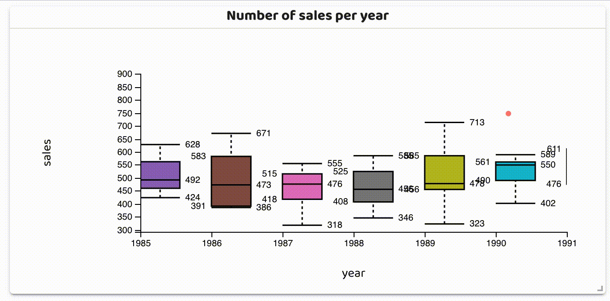

 
 

 

 

 

 
 

<h3>
<a href="../../issues/new">:speech_balloon: Ask a question</a> &nbsp;&nbsp;&nbsp;&nbsp;&nbsp;&nbsp;&nbsp;&nbsp; <a href="../../issues?q=is%3Aissue+is%3Aclosed+sort%3Aupdated-desc">:book: Read questions</a>
</h3>

# OlliePy - An alternative approach for evaluating ML models
> **OlliePy** is a python package which can help the data scientists in
> evaluating and analysing their machine learning experiments by
> utilising the power and structure of modern web applications. 
> The data scientist only needs to provide the data and any required 
> information and OlliePy will generate the rest.

###  Get started by following the [**OlliePy** guide](https://ahmed-mohamed-sn.github.io/olliePy/)

###   Interactive dashboard
|                                                                                                   |                                                                                                |
|:-------------------------------------------------------------------------------------------------:|:----------------------------------------------------------------------------------------------:|
|            **Bar chart**            |            **Box plot**            |
|          **Data table**           |            **Heat map**             |
|            **Histogram**            |       **Leaflet map**        |
| **Number display**    |          **Pie chart**           |
|            **Row chart**            |      **Scatter plot**      |
|            **Sun burst**            |   **Time bar chart**   |
|      **Time box plot**      | **Time line chart**  |
###  Error analysis report for regression demo

