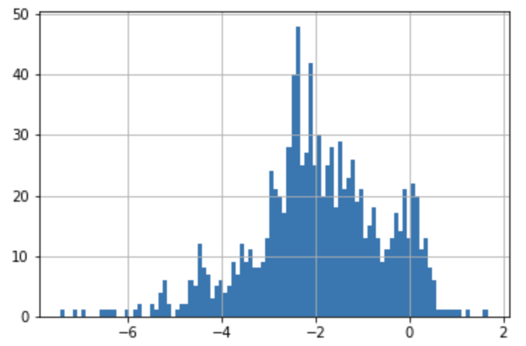

# Error analysis report for regression

Follow the following steps in order to generate the report.

1- Import the RegressionErrorAnalysisReport class from **OlliePy**

```
from olliepy import RegressionErrorAnalysisReport
```
2- Calculate the error for the training data after fitting the ML model.

```
y_train_pred = pipeline.predict(X_train)
train_df['error'] = y_train_pred - y_train
```

3- Calculate the error for the test/validation data

```
y_test_pred = pipeline.predict(X_test)
test_df['error'] = y_test_pred - y_test
```

4- Plot the test/validation error distribution

```
test_df['error'].hist(bins=100)
```



5- Create the error classes dictionary using the error distribution, where the key is the name of the error class,
 and the value is the min (inclusive) and max (exclusive) error of the class as a tuple.
 
```
error_classes = {
    'EXTREME_UNDER_ESTIMATION': (-8.0, -4.0),
    'HIGH_UNDER_ESTIMATION': (-4.0, -3.0),
    'MEDIUM_UNDER_ESTIMATION': (-3.0, -1.0),
    'LOW_UNDER_ESTIMATION': (-1.0, -0.5),
    'ACCEPTABLE': (-0.5, 0.5),
    'OVER_ESTIMATING': (0.5, 3.0)
}
```
7- Select the numerical and categorical features that you would like to include in the report

```
categorical_features = ['gender']
numerical_features = ['weight', 'height']
```

8- Create the report like the following example. Both the train and test/validation data frames should have the error and target columns.

```
report = RegressionErrorAnalysisReport(
                train_df=train_df,
                test_df=test_df,
                target_feature_name='BMI',
                error_column_name='error',
                error_classes=error_classes,
                acceptable_error_class='ACCEPTABLE',
                numerical_features=numerical_features,
                categorical_features=categorical_features,
                title='BMI Regression Report',
                subtitle='BMI distribution shift',
                output_directory='.',
                report_folder_name='BMI_REPORT',
                generate_encryption_secret=False)
```

```
report.create_report()
```

9- View the report using one of the following methods

- Using a local server

```
report.serve_report_from_local_server(mode='server')
```

- Save then view the report locally using the index.html file in the report folder

```
report.save_report(zip_report=True)
```
